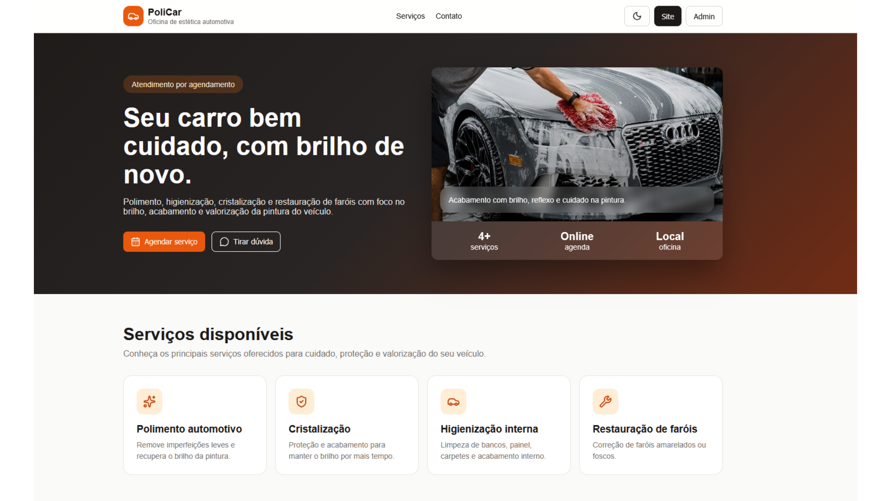
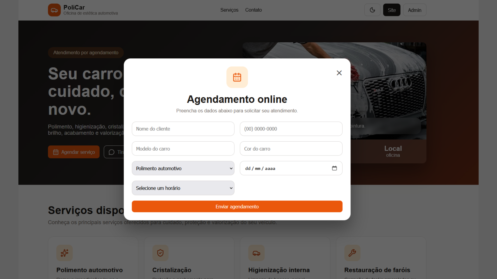
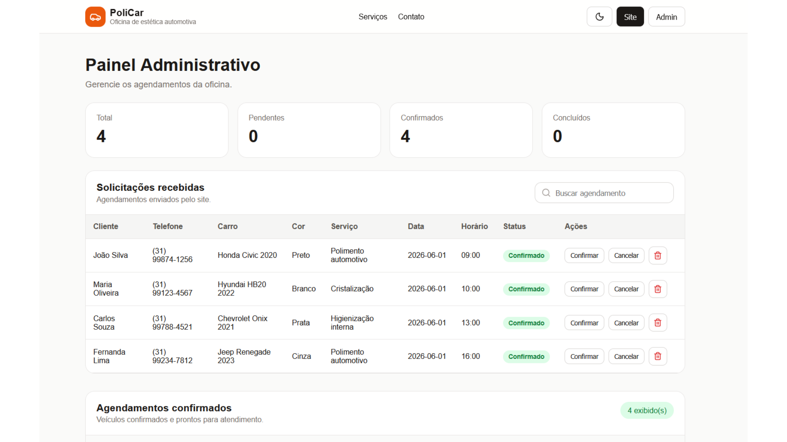
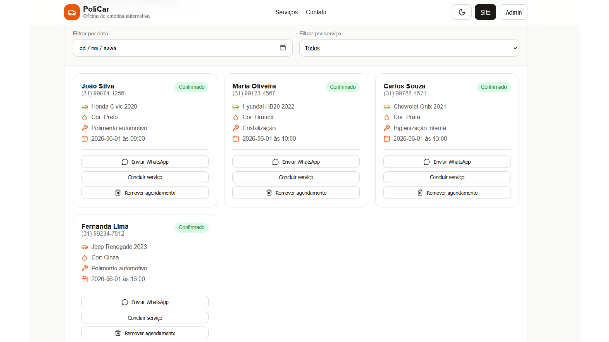

# 🚗 PoliCar

Sistema web para gestão de serviços de estética automotiva, desenvolvido com foco em agendamento online, apresentação de serviços e painel administrativo.

## 📌 Sobre o Projeto

O PoliCar foi desenvolvido como projeto de portfólio para simular o ambiente de uma oficina especializada em estética automotiva.

A aplicação permite que clientes visualizem os serviços oferecidos, consultem exemplos de trabalhos realizados e realizem solicitações de agendamento através de uma interface moderna e responsiva.

Além da área pública, o sistema possui uma área administrativa para gerenciamento dos agendamentos realizados.

---

## ✨ Funcionalidades

### Área do Cliente

- Visualização dos serviços disponíveis
- Portfólio com imagens de serviços realizados
- Agendamento online de serviços
- Interface responsiva para desktop e dispositivos móveis
- Tema claro e escuro

### Área Administrativa

- Dashboard com indicadores de agendamentos
- Listagem de solicitações
- Busca e filtros
- Controle de status dos atendimentos
- Visualização de agendamentos confirmados

---

## 🛠️ Tecnologias Utilizadas

### Frontend

- React
- JavaScript
- CSS3
- Vite
- Lucide React

### Backend (em desenvolvimento)

- ASP.NET Core
- C#
- REST API

### Controle de Versão

- Git
- GitHub

---

## 📂 Estrutura do Projeto

```text
Policar
│
├── frontend
│   ├── src
│   │   ├── components
│   │   ├── pages
│   │   ├── services
│   │   ├── data
│   │   ├── assets
│   │   └── styles
│
└── backend
    └── Policar.Api
```

---

## 🚀 Como Executar o Projeto

### Frontend

```bash
cd frontend

npm install

npm run dev
```
### Backend

```bash
cd backend

cd Policar.Api

dotnet run
```

A aplicação será iniciada em:

```text
http://localhost:5173
```

---

## 📸 Demonstração

### Página Inicial



### Agendamento Online



### Painel Administrativo




## 📑 Apresentação Completa

[Visualizar PDF](./PoliCar_Telas.pdf)

---

## 🎯 Objetivo

Este projeto foi desenvolvido para praticar conceitos de desenvolvimento frontend com React, componentização, gerenciamento de estado, responsividade, organização de código e integração futura com APIs desenvolvidas em ASP.NET Core.
